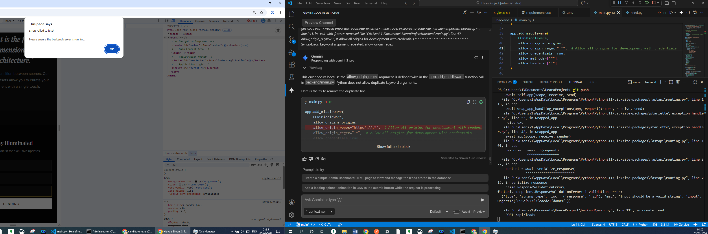
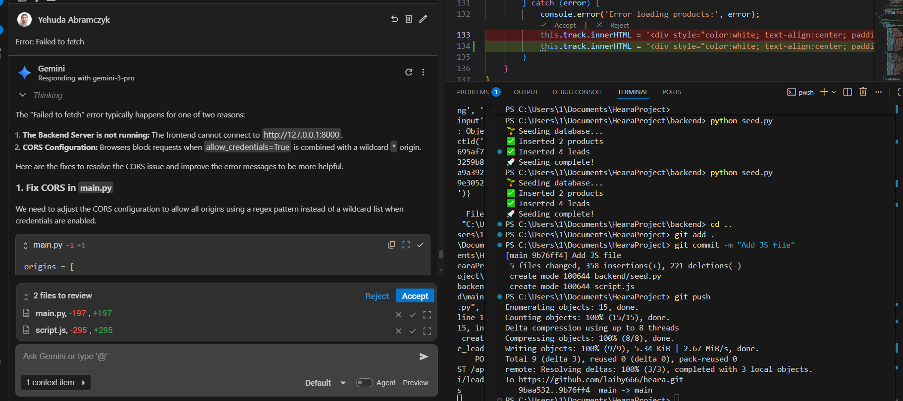

בחירת המוצר (סימן 1) נעשתה מכיוון שאהבתי את עיצוב המתג.
בחירת קהל היעד (B2C) נעשתה היות שאני חושב שזה מתאים לכל בית.
השתמשתי בג'מיני לאורך כל התהליך.
הוראות להרצת הפרויקט מצו"ב בקובץ Readme.md

<h3>צילומי מסך מהמערכת:</h3>

  

<strong>אתגרים:</strong> התחלתי בבניית האתר עם Tailwind ותכננתי להשתמש גם ב-Boilerplate, אך זה לא רץ באופן תקין והבנתי שמקוצר הזמן עדיף להשקיע בפונקציונליות קודם ולוודא שלכל הפחות יהיה אתר רץ גם אם העיצוב יהיה מינימליסטי יותר, לכן וויתרתי על הכלים הללו ובחרתי לעבוד עם CSS רגיל.

<strong>שיפורים עתידיים:</strong> עיצוב מתקדם ומושך, ניהול מוצרים ומשתמשים ביתר קלות ועוד.

